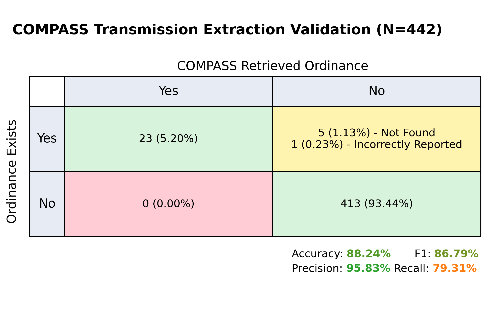
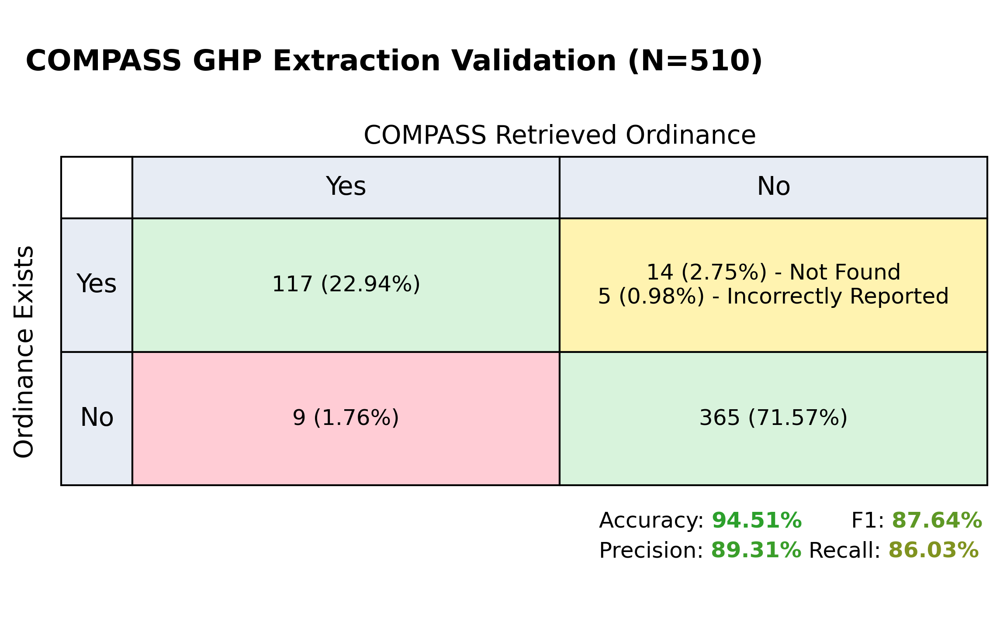
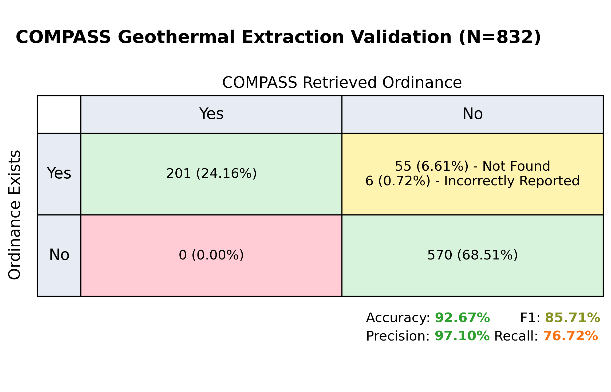
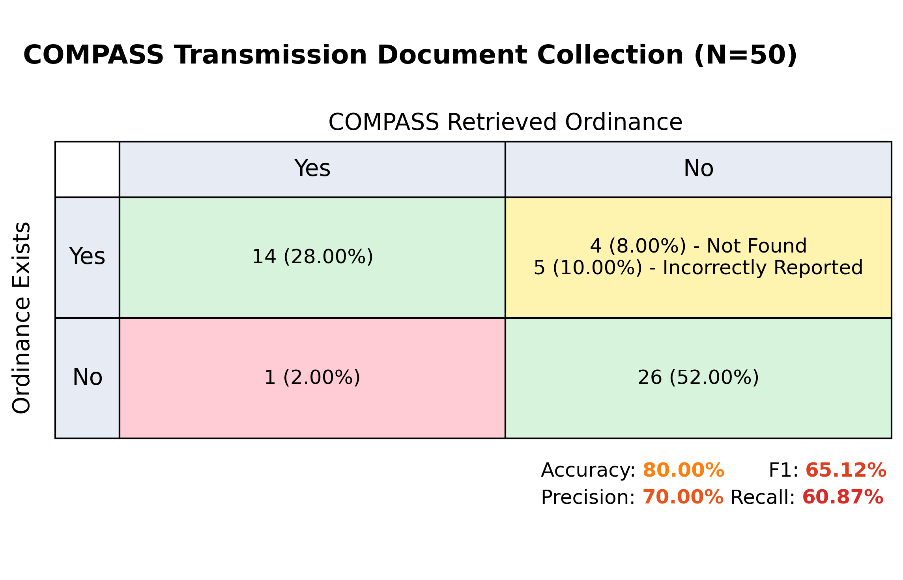
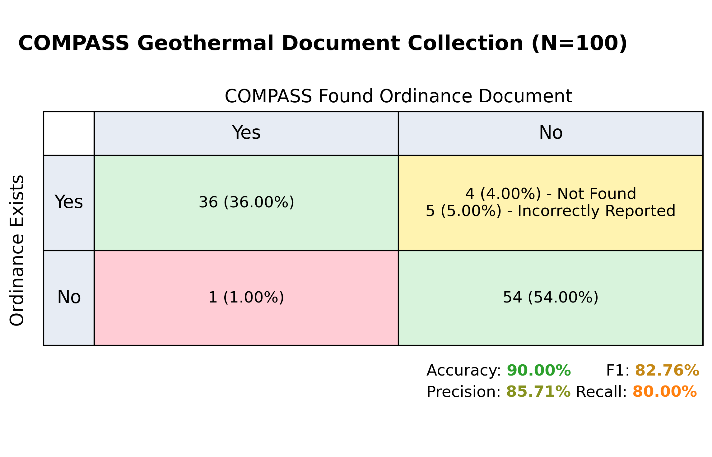
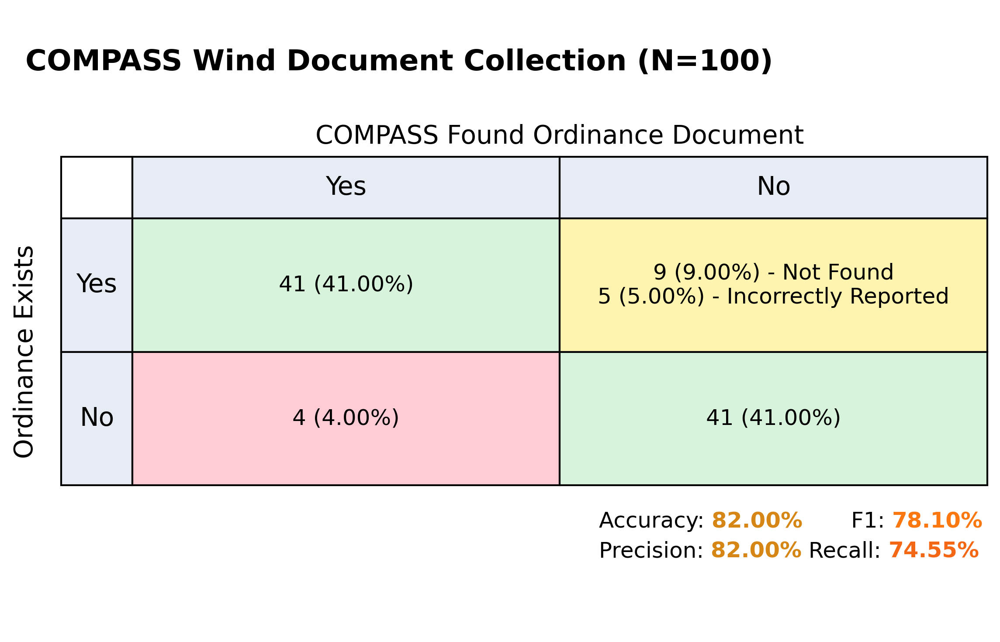
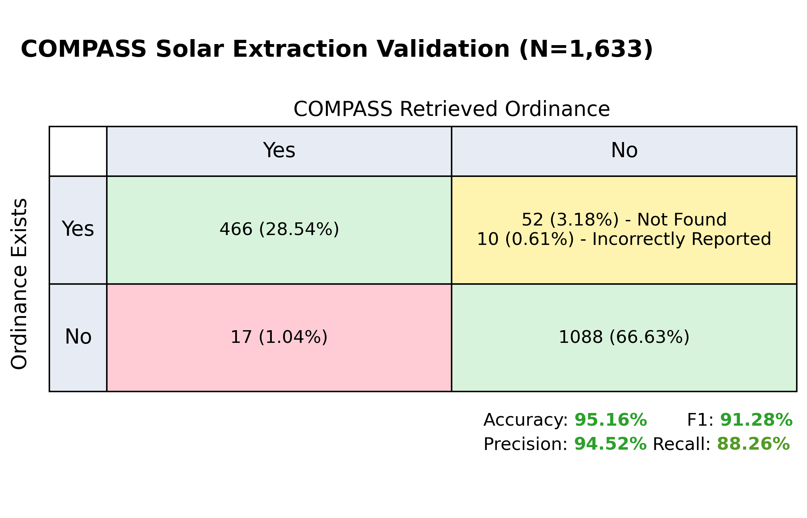
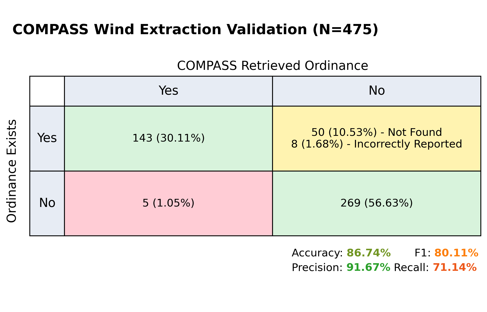
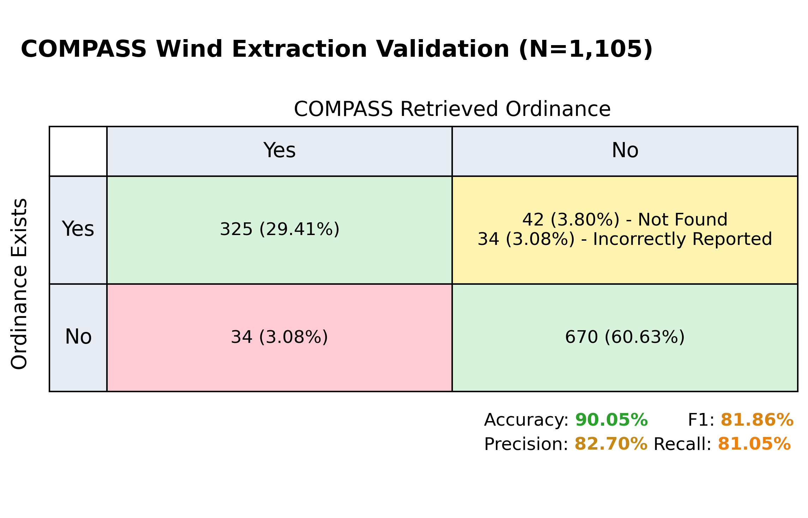

COMPASS Validation
==================

Here we give a brief overview of the results of known COMPASS validation efforts.

COMPASS validation is an ongoing effort, and we will update this page as new results become available.

Transmission Line Validation (August 2026)
------------------------------------------

This validation was for the ordinance value extraction portion only (assume documents are correct and belong
to the correct jurisdiction).

This validation focused on the model ability to extract structured ordinance data from unstructured wind ordinance text documents.

Info
^^^^

- **COMPASS Version**: `v0.28.0 <https://github.com/NatLabRockies/COMPASS/releases/tag/v0.28.0>`_
- **Number of Documents**: 17 (Assuming 40,000 jurisdictions with 10% population proportion, there is a 95% chance that the metrics are within ±14.26% of the reported value)
- **Features**:

  - structures
  - residential buildings
  - property line
  - roads
  - airport
  - ordinary high water mark
  - railroads
  - voltage threshold
  - electric field threshold
  - noise
  - maximum structure height
  - maximum tower height
  - maximum towe height
  - fencing
  - bond
  - decomissioning
  - permit
  - FAA
  - district use restriction
  - excluded lands
  - color
  - traffic disruption
  - fire prevention
  - lighting
  - signage
  - franchise
  - vegetation / landscaping requirements
  - ordinance effective year

- **Procedure Validated**: Ordinance extraction from documents
- **LLM(s) used**: OpenAI GPT-4.1-mini, OpenAI GPT-5-mini, OpenAI GPT-5.4

Results
^^^^^^^

Geothermal Heat Pump Validation (June 2026)
-------------------------------------------

This validation was for the ordinance value extraction portion only (assume documents are correct and belong
to the correct jurisdiction).

This validation focused on the model ability to extract structured ordinance data from unstructured wind ordinance text documents.

Info
^^^^

- **COMPASS Version**: `v0.22.0 <https://github.com/NatLabRockies/COMPASS/releases/tag/v0.28.0>`_
- **Number of Documents**: 15 (Assuming 40,000 jurisdictions with 10% population proportion, there is a 95% chance that the metrics are within ±15.18% of the reported value)
- **Features**:

  - driveways
  - property lines
  - yards
  - private water
  - public water
  - building foundation
  - wastewater
  - water line
  - sewer line
  - animal enclosures
  - roads
  - row
  - above ground fuel
  - below ground fuel
  - subsurface drains
  - wetlands
  - pools
  - hmat
  - noise
  - minimum well depth
  - maximum well depth
  - well definition
  - geothermal definition
  - ghp definition
  - licensed driller
  - certification
  - screening
  - permit
  - inspection
  - decommissioning
  - prohibitions cl
  - prohibitions ol
  - prohibitions other
  - ordinance effective year

- **Procedure Validated**: Ordinance extraction from documents
- **LLM(s) used**: OpenAI GPT-4.1-mini, OpenAI GPT-5-mini, OpenAI GPT-5.4

Results
^^^^^^^

Geothermal Electricity Validation (June 2026)
---------------------------------------------

This validation was for the ordinance value extraction portion only (assume documents are correct and belong
to the correct jurisdiction).

This validation focused on the model ability to extract structured ordinance data from unstructured wind ordinance text documents.

Info
^^^^

- **COMPASS Version**: `v0.18.0 <https://github.com/NatLabRockies/COMPASS/releases/tag/v0.28.0>`_
- **Number of Documents**: 38 (Assuming 10,000 jurisdictions with 10% population proportion, there is a 95% chance that the metrics are within ±9.52% of the reported value)
- **Features**:

  - residential zones
  - property lines
  - roads
  - railroads
  - existing transmission lines
  - water bodies
  - combustible tanks
  - domestic wells
  - active faults
  - schools
  - hospitals
  - drilling start time
  - drilling end time
  - noise
  - maximum height
  - minimum lot size
  - fencing
  - color requirements
  - lighting requirements
  - visual impact assessment
  - seismic monitoring plan
  - required permits
  - primary use districts
  - special use districts
  - prohibited use districts
  - bond requirement
  - decommissioning
  - prohibitions
  - ordinance effective year

- **Procedure Validated**: Ordinance extraction from documents
- **LLM(s) used**: OpenAI GPT-4.1, OpenAI GPT-5

Results
^^^^^^^

Geothermal Heat Pump Document Collection Validation (June 2026)
---------------------------------------------------------------
This validation was for the document collection portion only.

Info
^^^^

- **COMPASS Version**: `v0.22.0 <https://github.com/NatLabRockies/COMPASS/releases/tag/v0.22.0>`_
- **Number of Documents**: 50  (Assuming 10,000 jurisdictions, there is a 95% chance that the metrics are within ±13.83% of the reported value)
- **Features**: None
- **Procedure Validated**: Document collection from web
- **LLM(s) used**: OpenAI GPT-4.1-mini, GPT-5-mini, OpenAI GPT-5.4

Results
^^^^^^^

Transmission Line Document Collection Validation (June 2026)
------------------------------------------------------------
This validation was for the document collection portion only.

Info
^^^^

- **COMPASS Version**: `v0.18.1 <https://github.com/NatLabRockies/COMPASS/releases/tag/v0.18.1>`_
- **Number of Documents**: 50  (Assuming 10,000 jurisdictions, there is a 95% chance that the metrics are within ±13.83% of the reported value)
- **Features**: None
- **Procedure Validated**: Document collection from web
- **LLM(s) used**: OpenAI GPT-4.1-mini, OpenAI GPT-5

Results
^^^^^^^

Geothermal Electricity Document Collection Validation (May 2026)
----------------------------------------------------------------
This validation was for the document collection portion only.

Info
^^^^

- **COMPASS Version**: `v0.15.2 <https://github.com/NatLabRockies/COMPASS/releases/tag/v0.15.2>`_
- **Number of Documents**: 100  (Assuming 10,000 jurisdictions, there is a 95% chance that the metrics are within ±9.75% of the reported value)
- **Features**: None
- **Procedure Validated**: Document collection from web
- **LLM(s) used**: OpenAI GPT-4.1, OpenAI GPT-5

Results
^^^^^^^

Wind Document Collection Validation (September 2025)
----------------------------------------------------
This validation was for the document collection portion only.

Info
^^^^

- **COMPASS Version**: `v0.8.2 <https://github.com/NatLabRockies/COMPASS/releases/tag/v0.8.2>`_
- **Number of Documents**: 100  (Assuming 10,000 jurisdictions, there is a 95% chance that the metrics are within ±9.75% of the reported value)
- **Features**: None
- **Procedure Validated**: Document collection from web
- **LLM(s) used**: OpenAI GPT-4o-mini, OpenAI GPT-4.1-nano, OpenAI GPT-4.1-mini, OpenAI GPT-4.1

Results
^^^^^^^

Solar Validation (August 2025)
------------------------------

This validation was for the ordinance value extraction portion only (assume documents are correct and belong
to the correct jurisdiction).

This validation focused on the model ability to extract structured ordinance data from unstructured wind ordinance text documents.

Info
^^^^

- **COMPASS Version**: `v0.7.0 <https://github.com/NatLabRockies/COMPASS/releases/tag/v0.7.0>`_
- **Number of Documents**: 71 (Assuming 10,000 jurisdictions, there is a 95% chance that the metrics are within ±11.59% of the reported value)
- **Features**:

  - structures (participating)
  - property line (participating)
  - structures (non-participating)
  - property line (non-participating)
  - roads
  - railroads
  - transmission
  - water
  - noise
  - maximum height
  - maximum project size
  - minimum lot size
  - maximum lot size
  - density
  - coverage
  - prohibitions
  - decommissioning
  - glare
  - visual impact
  - primary use districts
  - special use districts
  - accessory use districts
  - ordinance effective year

- **Procedure Validated**: Ordinance extraction from documents
- **LLM(s) used**: OpenAI GPT-4.1-nano, OpenAI GPT-4.1-mini, OpenAI GPT-4.1

Results
^^^^^^^

Mini Wind Validation (June 2025)
--------------------------------

This validation was for the ordinance value extraction portion only (assume documents are correct and belong
to the correct jurisdiction).

This validation effort is meant primarily as a sanity check and as a stepping stone to:

- Perform a larger validation effort for solar ordinance values, and
- Begin a CONUS-level COMPASS run for wind ordinance collection.

.. WARNING::
    The number of documents examined is extremely small compared to the total number of jurisdictions.
    Interpret all results with extreme caution!

Info
^^^^

- **COMPASS Version**: `v0.5.0 <https://github.com/NatLabRockies/COMPASS/releases/tag/v0.5.0>`_
- **Number of Documents**: 19 (Assuming 6,000 jurisdictions, there is a 95% chance that the metrics are within ±22.45% of the reported value)
- **Features**:

  - structures (participating)
  - structures (non-participating)
  - property line (participating)
  - property line (non-participating)
  - roads
  - railroads
  - transmission
  - water
  - noise
  - maximum height
  - maximum project size
  - minimum lot size
  - maximum lot size
  - shadow flicker
  - tower density
  - blade clearance
  - primary use districts
  - special use districts
  - accessory use districts
  - color
  - decommissioning
  - lighting
  - prohibitions
  - visual impact
  - ordinance effective year

- **Procedure Validated**: Ordinance extraction from documents
- **LLM(s) used**: OpenAI GPT-4o-mini

Results
^^^^^^^

Wind Validation (January 2024)
------------------------------

This validation was for the ordinance value extraction portion only (assume documents are correct and belong
to the correct jurisdiction).

This is the original model validation, focusing on the model ability to extract structured ordinance data from
unstructured wind ordinance text documents.

Info
^^^^

- **COMPASS Version**: alpha
- **Number of Documents**: 83 (Assuming 3,000 jurisdictions, there is a 95% chance that the metrics are within ±10.61% of the reported value)
- **Features**:

  - structures setbac
  - property lines
  - roads
  - railroads
  - transmission
  - water
  - noise
  - maximum height
  - minimum lot size
  - shadow flicker
  - tower density

- **Procedure Validated**: Ordinance extraction from documents
- **LLM(s) used**: OpenAI GPT-4

Results
^^^^^^^

.. Margin of error calculator: https://www.calculator.net/sample-size-calculator.html
